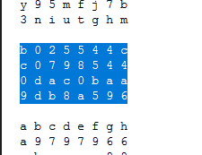

# Do you know ㅁㅁㅁ?

###### 706p

> 어렵디 어려운 이 문제... 누가 풀 것인가?
> 복호화 사이트 -> ㅁㅁㅁencryption.com
> hint1 : cat == 고양이
> hint2 : md5encryption.com
> hint3 : dog == 갯수
>
> [Link](https://drive.google.com/open?id=13Kb81JEufuP4GIXUol0EuUHX_guvGueo)

-------------

처음 힌트가없었을때는 `ㅁㅁㅁencryption.com` 이 [pdfencryption.com](http://pdfencryption.com/) 인줄알았다.

Password Protected 되있는데다가 HINT로 dogs name이라니....

그런데 나중에 힌트로 `md5encryption.com`을 줬을때 직감적으로 Link에 있는 텍스트파일에서 md5의 형태를 지닌 해쉬를 찾아야 한다는 생각이 들어서 hexdigest 되어 나올수있는 해쉬를 찾았더니

`b025544cc07985440dac0baa9db8a596`가 있었고 

그걸 주어진 사이트에서 Decryption을 하니 위 해쉬는 `FLAG is FLAG{MD5_3nCryPt_Ye@h!}`라는 문자의 해쉬라는것이 나왔다.

-------------------

FLAG는 `FLAG{MD5_3nCryPt_Ye@h!}`이다