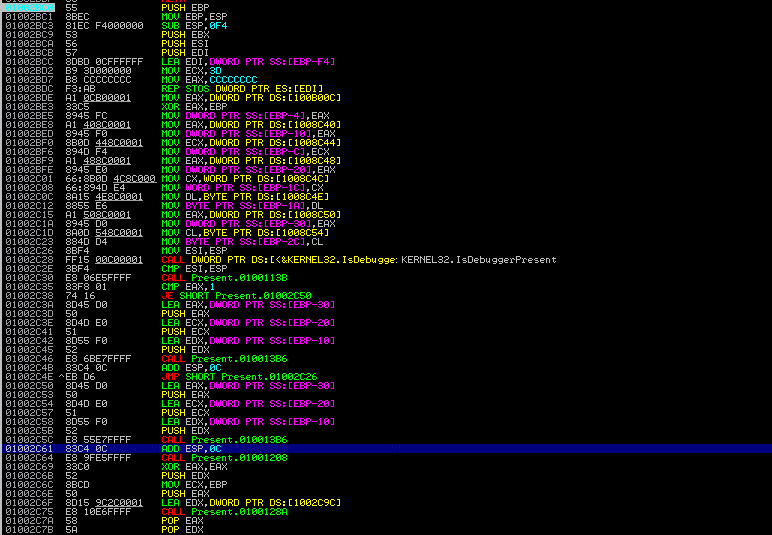
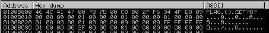
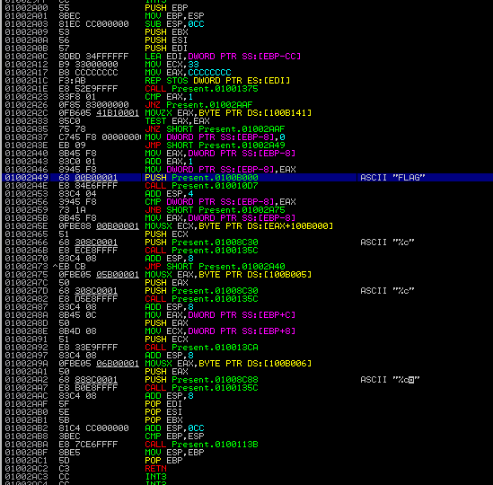
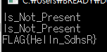

# Present

###### 934p

>점수가 들어있는 간단한 문제상자입니다. 
>우회해야 할까? 말아야 할까? 
>hint : FLAG.find("Hello") == 5 
>
>[Link](https://github.com/Gyeongje/CTF/blob/master/Present.exe)

-------------

또 PE파일을 준다.

또 Immdbg를 켠다.

다만 이 문제는 분석이 좀 필요하다.



우선 Main은 0x1002BC0이다. 이번엔 그냥 VC++컴파일러가 main으로가는 방법을 유추해서 알아냈다.

IsDebuggerPresent로 여러번 디버거를 찾는데 전부 우회해서는 안된다.

이 문제의 공략법은 FLAG가 출력되는곳을 찾는것이다.



우선은 메모리에 FLAG가있는거로보아서 연산은 저 사잇값만 되는거임을 알수있다.

그러므로 저 FLAG가 사용되는곳을 따라가야한다.



우선 FLAG는 0x2A00함수에서 사용된다. 그리고 반복문을 통해서 한글자씩 출력한다.

그런데 이 함수에 접근하는 함수를 거꾸로 타고 올라가면 main->0x2890->0x2950를 거쳐서 올 수 있다는걸 알수있고 그중에 IsDebuggerPresent가 있는 함수에서 우회해야할지 하지말아야할지를 알수있다.

그래서 실행하면서 적절히 0x2A49에 도달하도록 우회해주면 다음과같이 출력 된다.

나는 직접 EAX레지스터의 값을 바꾸거나 EIP를 직접 수정하면서 했다.



이 플래그로는 인증이 안되서 게싱으로 한자리 바꿔주면 플래그가 된다.

--------------

## Alter

혹은 0x2729와 0x2D70 에 플래그 복호화루틴이있는데 이를 시뮬해줘도 된다.

소스는 다음과 같다

```python
flag=""

kim="Ir[G\x7Fm{"
table=[0x1,0x16,0x33,0x22,0x1,0x2B,0xC,0x22,0x25,0x36,0x1C]#0x2729
for i in range(len(kim)):
    flag+=(chr(ord(kim[i])^table[i]^i**2))
kim2="FLAG"
table2=[0x22,0x25,0x36,0x1C]#0x2D70
for i in range(len(kim2)):
    flag +=(chr(ord(kim2[i])^table2[i]^i**2))
print(flag)
```


-------------

FLAG는 `FLAG{Hello_SdhsR}`이다.