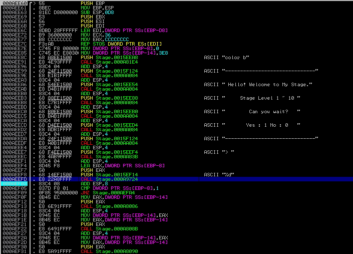
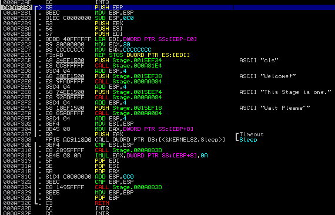
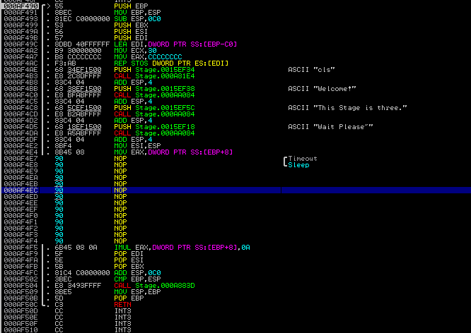
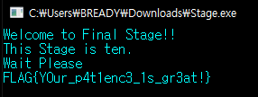

# Stage Game

###### 229p

>인내의 시간..
>Stage Level 1~10
>hint : Sleep
>
>[Link](https://drive.google.com/uc?export=download&id=1wB0mMTZUUSPveVVfDSE8_Mp6NZDRS7tY)

-----------------

PE파일을 준다. 

그러니 Immunity Debugger로 분석해보았다.

우선 main은 0xAEE60 부터 시작된다.

이는 여러 방법으로 알수있지만 나는 VC++로 컴파일 한것같이 생겨서 Main Invoked 라는 문자열을 타고서 찾았다.

그러고 나서는 스테이지별로 함수를 호출해서 EAX로 받은 인자를 timeout 인자로 넣어서 Sleep하는데 이때 각 스테이지마다이 이 EAX인자로받은 수가 10배씩 증가한다. 1스테이지에 1초이면 2스테이지에 10초 3스테이지에 100초 이런식이다. 

이때 PUSH되는 값을 0으로 맞추어주면 sleep이 매우 빠른시간에 끝나게된다.

그러나 나중에 FLAG가 만들어질때 이 EAX값을 쓰기때문에 EAX값은 직접 바꿀수없다. 그래서 다음과 같이 코드패치하였다.

0xA883D함수를 패치하지않으면 오류가 나기때문에 안된다.

이런식으로 진행을 계속하면 0xAF9B0함수에서 플래그를 복호화하는데 이떄 EAX가 정상적이면 플래그가 잘 나온다.

----------------------------

FLAG는 `FLAG{Y0ur_p4t1enc3_1s_gr3at!}`이다.