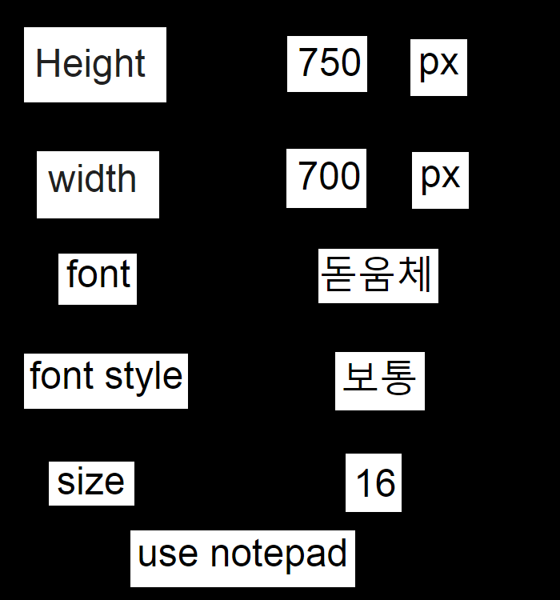
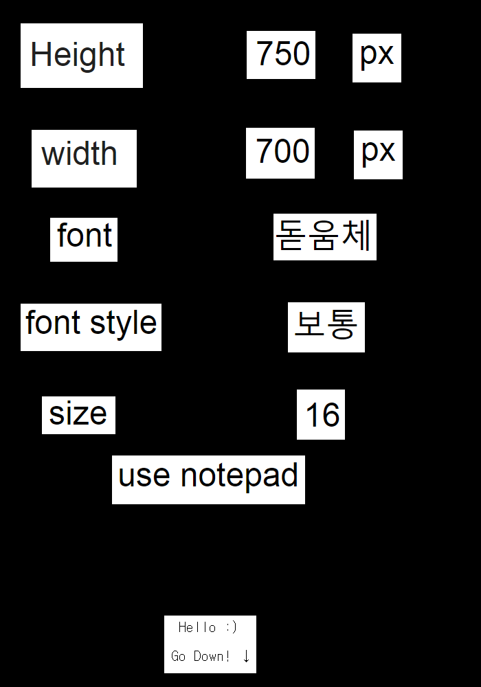
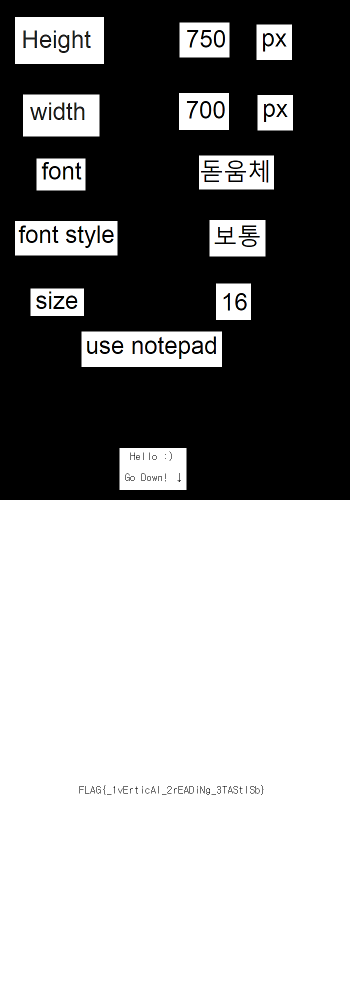

# Vocabulary

###### 460P

>플래그가 적힌 친구의 단어장을 잃어버렸다 
>어서 빨리 찾아야 된다.
>그 친구가 화내기 전에 플래그라도 찾아보자
>hint : PNG height
>
>[Link](https://drive.google.com/uc?export=download&id=1sWBQKhFXDzjSiVrwnihE8boFVB5y_0tc)

-----------------



라는 이미지를 주는데 `use notepad`라고 힌트를 줘서 메모장으로 열면 다음과같은 메세지가 나온다.

```
{VOcAbulAry}
_________________________________________________________
1장
vAluE 값		|vAry 서로 다르다		|
ExpEriENcE 경험		|ENSurE	반드시 .. 하게 하다	|
rEfErENcE 언급		|rEquESt 요청			|
thrOugh ...을 통해	|vAry 서로 다르다		|
iDENtify 확인하다	|ENSurE	반드시 .. 하게 하다	|
cONcErN 영향을 미치다	|rEquESt 요청			|
AblE 할 수 있는		|vAry 서로 다르다		|
likEly ...할 것 같은	|ENSurE	반드시 .. 하게 하다	|
_________________________________________________________
2장
rEMAiN 계속 ... 이다	|rEquESt 요청			|
ENcOurAgE 격려하다	|vAry 서로 다르다		|
ApplE 사과		|ENSurE	반드시 .. 하게 하다	|
DEtErMiNE 알아내다	|rEquESt 요청			|
iMplEMENt 시행하다	|vAry 서로 다르다		|
NEcESSAry 필요한	|ENSurE	반드시 .. 하게 하다	|
gENErAl 일반적인	|rEquESt 요청			|
_________________________________________________________
3장
ThiS lEttEr wAS firSt iNtrODucED iN ENglAND AND luckED
ArOuND thE wOrlD A yEAr, AND NOw thiS lEttEr tO yOu 
ShOulD lEAvE yOu withiN fOur DAyS. YOu MuSt SEND SEvEN Of
thESE, iNcluDiNg thiS lEttEr, tO SOMEONE whO NEEDS gOOD
luck. COpyiNg iS AlSO rEcOMMENDED. It MAy bE 
SupErStitiON, but it iS truE.IN ADDitiON, thE FLAG MAy 
bE........bEE.......bEEEE.....{ tHANk_FiND_MY_vOCAbuLAry
}. MAybE NOt. Or iNcrEASE the hEight tO 1000px.
```

가볍게 `{tHANk_FiND_MY_vOCAbuLAry}`라는 Fake FLAG를 던져주고 높이를 1000px까지 늘리라고한다.

PNG file structure을 참고해서 IHDR청크속 ihdr구조체의 height값을 1000으로 바꿔주면 아래같은 이미지가 나온다.



더 내려가라고하니 height값을 더 늘려줘야겠다.



2000px까지 늘여주면 플래그가 보인다

------------------

FLAG는 `FLAG{_1vErticAl_2rEADiNg_3TAStlSb}`이다.